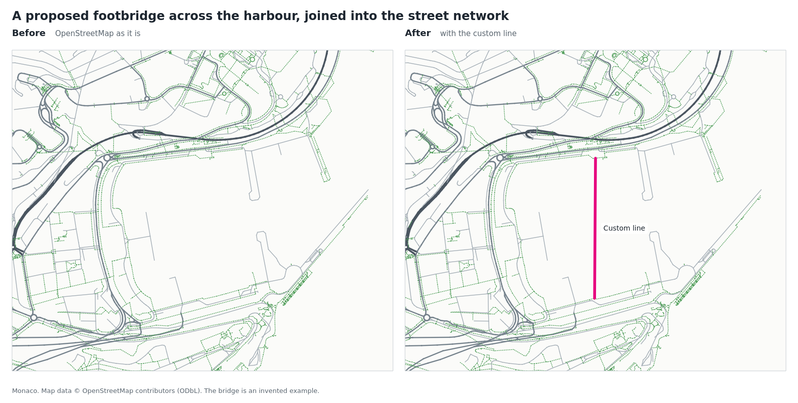
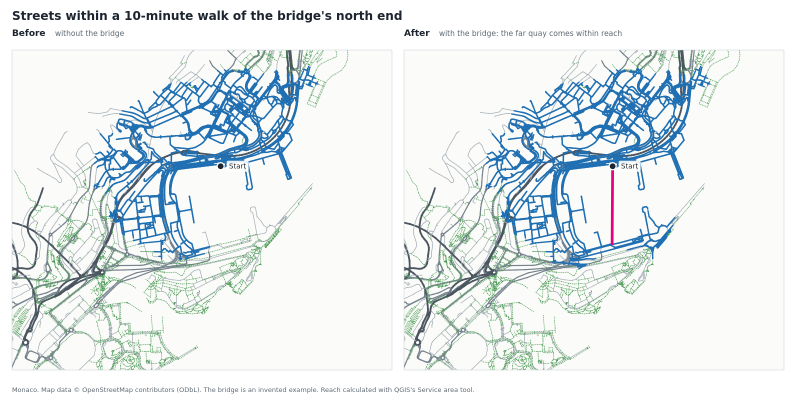
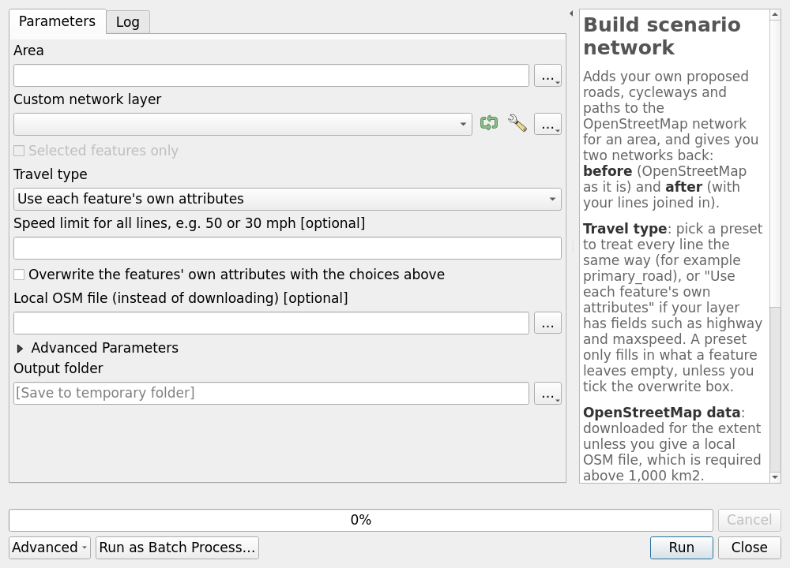

# NetworkForge QGIS plugin

[](https://github.com/Yibbzz/networkforge-qgis/actions/workflows/tests.yml)
[](https://codecov.io/gh/Yibbzz/networkforge-qgis)

A QGIS plugin for adding your own proposed roads, cycleways and paths to
the OpenStreetMap network, and getting a **before** and an **after**
network back as QGIS layers (plus OSM PBF files for routers such as
Valhalla). It can also change or remove existing streets, and build a
network from your own lines alone, without OpenStreetMap.

## Goal

In ArcGIS, building a routable network from your own street data means
the paid Network Analyst extension and a long setup: connectivity
rules, costs, restrictions, travel modes, then a build. This project
aims to give QGIS users the same ability for free, with far fewer
steps, on top of OpenStreetMap:

1. **Make the network in QGIS.** Draw or load your own lines and
   describe them with ordinary attributes. NetworkForge joins them into
   the OpenStreetMap street network and writes the result as an OSM PBF
   file.
2. **Analyse it with Valhalla.** Load that PBF into the
   [QGIS Network Analyst plugin](https://github.com/routing-earth/network-analyst-qgis-plugin),
   which builds a Valhalla routing graph from it on your own computer:
   routes, isochrones, travel time matrices and more, with no server to
   set up.
3. **Follow documentation that is easier than Esri's.** Short tutorials
   that start from a real planning question and work in the QGIS,
   OpenStreetMap and Valhalla world.

Step 1 works today. Step 2 is the next thing to prove and document; see
the [roadmap](docs/roadmap.md) for where things stand and what comes
next.

## What it does

You draw a proposal as a line layer, here an invented footbridge across
Monaco's harbour, and the plugin joins it into the OpenStreetMap street
network. You get the network as it is (**before**) and with your lines
(**after**), coloured by kind of street with your lines highlighted:



Because both networks are ordinary QGIS layers with travel columns
(`walk`, `bike`, `car`, `speed_kph`, direction), QGIS's own network
tools work on them. Running **Service area (from point)** on each shows
what the proposal changes, here the streets within a 10-minute walk:



The **Build scenario network** tool, in the Processing Toolbox:



Map data in the images © OpenStreetMap contributors (ODbL).

### What people use it for

[Use cases](docs/use-cases.md) walks through the most common questions,
step by step:

- **Planning**: what does a proposed road, cycleway or bridge change?
- **Floods and other emergencies**: which places are cut off, or lose
  their ambulance cover, if these roads close?
- **Traffic schemes**: closing a street, a one-way scheme, a low-traffic
  neighbourhood, a 20 mph zone.
- **Your own street data**: route on a planned neighbourhood or a
  council's centrelines, without OpenStreetMap.

This is a proof of concept and the QGIS front end only. All the network
logic lives in the separate engine,
[NetworkForge](https://github.com/Yibbzz/networkforge), which the plugin
will install into its own environment and run as a separate program.

## Status

Early development. The plugin adds a "NetworkForge" group to the
Processing Toolbox with four tools:

- **Check custom network layer** - checks your lines and attributes in
  seconds, without downloading anything. Problems are listed with a link
  to the guide, and the features concerned are selected.
- **Build scenario network** - choose an area and a layer of your own
  lines, and say how they are travelled: a preset such as `primary_road`
  for every line, or each feature's own attributes. OpenStreetMap data
  is downloaded for the area, or read from a local OSM file (required
  above 1,000 km2). You get a **Before network** and an **After
  network** layer coloured by kind of street, with your lines
  highlighted in the after layer, and `before.osm.pbf` and
  `after.osm.pbf` in the output folder for routers. Features named in a
  warning or error are selected in your layer. A feature can also
  **change or remove an existing street** instead of adding a line (see
  below).
- **Build standalone network** - turns a line layer of your own (council
  centrelines, a survey, the streets of a planned neighbourhood) into a
  routable network without OpenStreetMap: no area to choose, nothing
  downloaded, no before network. You choose where lines join: wherever
  they cross, or only where they share a vertex (for data that already
  has a vertex at every junction). You get a **Network** layer and
  `network.osm.pbf`. If the lines don't form one connected network, a
  warning says so and the lines outside the largest piece are selected.
- **Engine information** - shows the installed engine's version and what
  it supports, and can reinstall it.

The engine is installed on first use (once, needs an internet
connection).

The engine goes into a `networkforge` folder inside your QGIS profile
folder, next to an `engine.log` file that is useful when reporting
problems. Deleting that folder removes the engine; the plugin installs
it again when next needed.

## Install

In QGIS, add this plugin's repository once; after that QGIS installs it
and offers updates like any other plugin:

1. **Plugins > Manage and Install Plugins > Settings**.
2. Tick **Show also Experimental Plugins**.
3. Under **Plugin Repositories** click **Add**, give it the name
   `NetworkForge` and this URL, then **OK**:

   ```
   https://github.com/Yibbzz/networkforge-qgis/releases/latest/download/plugins.xml
   ```
4. Go to the **All** tab, search for **NetworkForge** and click
   **Install Plugin**.

Alternatively, download the zip from the
[latest release](https://github.com/Yibbzz/networkforge-qgis/releases/latest)
and use **Install from ZIP**.

Your custom network layer is any line layer you draw in QGIS. Give it a
text field called `highway` (and optionally `maxspeed`, `oneway`, ...)
to describe each line, or leave the fields out and pick a preset when
you build. Save it as a GeoPackage, not a Shapefile, which shortens
field names.

### Changing or removing an existing street

In **Build scenario network**, a feature that carries an OpenStreetMap
way id changes that street instead of adding a line:

1. Build once, then copy the street from the **Before network** layer
   into your custom layer. Its way id is in the `osmid` field; your
   layer needs a field called `osmid` or `osm_id` to receive it.
2. Edit the copy's attributes: `oneway` = `yes` to make it one-way,
   `access` = `no` to close it, a new `maxspeed` or `highway`. Or set a
   field called `remove` to `yes` to take the street out altogether.
3. Build again. Changed streets are drawn in orange in the After
   network; removed streets are in the Before network only.

The engine's
[tagging guide](https://github.com/Yibbzz/networkforge/blob/v0.11.0/docs/tagging-guide.md#changing-existing-streets)
has the details.

## Requirements

QGIS 3.34 or newer (developed on the 3.44 LTR).

## Development install

Link the plugin package into your QGIS profile, then enable it in QGIS:

```sh
mkdir -p ~/.local/share/QGIS/QGIS3/profiles/default/python/plugins
ln -s "$PWD/networkforge_qgis" ~/.local/share/QGIS/QGIS3/profiles/default/python/plugins/
```

In QGIS: **Plugins > Manage and Install Plugins > Installed**, tick
**NetworkForge**. Install the **Plugin Reloader** plugin to reload the
code after changes without restarting QGIS.

## Tests

The tests use `pytest` and `pytest-qgis` with the Python that QGIS
uses. On Linux, with [uv](https://docs.astral.sh/uv/) installed:

```sh
uv venv --python /usr/bin/python3 --system-site-packages .venv
uv pip install --python .venv/bin/python -r requirements-dev.txt
QT_QPA_PLATFORM=offscreen .venv/bin/python -m pytest
```

Add `--cov` to see how much of the plugin's code the tests run.

Most tests use a stand-in for the engine (`tests/fake_engine.py`) that
plays back prepared replies, so they run in seconds. The end-to-end
tests (`-m engine`) use the real engine on a tiny hand-made street grid
(`tests/data/grid.osm`); their first run installs the engine, which
needs an internet connection. To skip them: `pytest -m "not engine"`.

GitHub runs all of them on every push, in the official QGIS Docker
image, for both the long-term release and the latest QGIS.

## Releasing

Pushing a version tag such as `v0.1.0` runs `.github/workflows/release.yml`:
it builds the plugin zip with `qgis-plugin-ci` and attaches it to a
GitHub release, together with the `plugins.xml` that the install steps
above point QGIS at. If the repository secrets `OSGEO_USERNAME` and
`OSGEO_PASSWORD` are set, it also publishes to plugins.qgis.org.

To build a zip by hand: `uvx qgis-plugin-ci package 0.1.0`.

## Limitations

No public transport and no traffic simulation. Turn restrictions that
are in OpenStreetMap are kept in the PBF files and routers obey them,
but you can't add your own, and the QGIS layers know nothing of them.
An existing street can be changed or removed, not redrawn: to move one,
remove it and draw the new line. A standalone network has no turn
restrictions, traffic signals or gates, because a line layer can't
carry them.

## Credits and licence

Map data © OpenStreetMap contributors, available under the
[Open Database License](https://www.openstreetmap.org/copyright). A
standalone network contains only your own data.

GPL-3.0, see [LICENSE](LICENSE).
