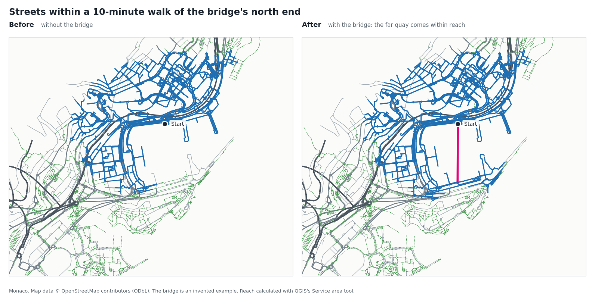

# NetworkForge QGIS plugin

[](https://github.com/Yibbzz/networkforge-qgis/actions/workflows/tests.yml)
[](https://codecov.io/gh/Yibbzz/networkforge-qgis)
[](https://github.com/Yibbzz/networkforge-qgis/actions/workflows/network-analyst-latest.yml)

A QGIS plugin for adding your own proposed roads, cycleways and paths to
the OpenStreetMap network. You get a **before** and an **after** network
back as OSM PBF files for routers such as Valhalla, and as QGIS layers to
look at. It can also change or remove existing streets, ban turns, add
bollards and signals, and build a network from your own lines alone,
without OpenStreetMap.

Routing on the result is done with routing.earth's
[QGIS Network Analyst plugin](https://github.com/routing-earth/network-analyst-qgis-plugin),
which runs Valhalla on your own computer. Together the two give QGIS
users a routable network of their own, for free. The PBF files also
work in [R5](https://github.com/conveyal/r5), the router behind public
transport and accessibility tools (tested in the engine).


QGIS's own **Service area** tool works on the before and after layers
too, here showing the streets within a 10-minute walk:



## Start here

- **[The tutorial](docs/tutorial.md)**: a whole scheme, step by step with
  screenshots: a commute across the Thames in Reading, a new bridge,
  changes to the streets around it, and routes before and after with
  the Network Analyst plugin. The data to follow along is included.
- **[The public transport tutorial](docs/tutorial-transit.md)**: Esri's
  transit tutorial done in QGIS with the Easy-R5 plugin: Cincinnati's
  streets and two bus companies' timetables, 30-minute service areas
  from downtown at 5:15 pm and 2:00 pm, two closed public stairways
  reopened to see how much more of the city people on the hill can reach,
  and a new tram line added to the timetables.
- **[The traffic tutorial](docs/tutorial-traffic.md)**: rush hour in
  Bristol: traffic added to an OpenStreetMap extract with "Add traffic",
  and 15-minute driving areas from a hospital at 3 am and 8 am with the
  Network Analyst plugin's isochrones.
- **[Examples](docs/examples.md)**: six short ones with pictures: a
  footbridge, a closed street, a network from six lines, a one-way
  street, a banned turn and a bollard.
- **[Use cases](docs/use-cases.md)**: planning, floods and closures,
  traffic schemes, your own street data.
- **[Moving an ArcGIS street network to QGIS](docs/migrating-from-arcgis.md)**.

## Install

NetworkForge is on the
[QGIS plugin repository](https://plugins.qgis.org/plugins/networkforge_qgis/)
as an experimental plugin. Needs QGIS 3.34 or newer.

1. In QGIS, open **Plugins > Manage and Install Plugins > Settings**.
2. Tick **Show also Experimental Plugins**.
3. On the **All** tab, search for **NetworkForge** and click
   **Install Plugin**.

Or download the zip from the
[latest release](https://github.com/Yibbzz/networkforge-qgis/releases/latest)
and use **Install from ZIP**.

The first time you run a tool, the plugin installs its engine into a
`networkforge` folder in your QGIS profile (once, needs an internet
connection). Nothing is installed into QGIS itself. The `engine.log`
file in that folder is useful when reporting a problem.

## The tools

In the Processing Toolbox, under **NetworkForge**:

- **Build scenario network**: your lines joined into OpenStreetMap for an
  area, giving the before and after networks. OpenStreetMap is
  downloaded for areas up to 1,000 km2; for bigger ones, give it a
  downloaded OSM file.
- **Build standalone network**: a network from your own lines alone.
- **Add traffic (time of day)**: slower streets at busy times for the
  Valhalla router ("main roads at 60% on weekday mornings"), by road
  class, for single streets you pick or draw, and from a table of
  measured speeds by OpenStreetMap way. It writes Valhalla's
  graph as a `.tar` file for the Network Analyst plugin's "From Tar";
  routes with a departure time use it. The bands are your assumptions,
  not measured traffic. See the engine's
  [traffic guide](https://github.com/Yibbzz/networkforge/blob/v1.3.0/docs/traffic.md).
- **Check custom network layer**: checks your lines and attributes in
  seconds, without downloading anything.
- **Engine information**: the installed engine's version; it can also
  reinstall the engine.

## Describing your lines

Your lines are an ordinary QGIS line layer (a GeoPackage, not a
Shapefile, which shortens field names). Each line is described with
OpenStreetMap's own field names, such as `highway`, `maxspeed` and
`oneway`, or you pick a preset for all of them when you build. The same
layer can change or remove existing streets and ban turns, and a second,
points layer adds bollards, signals and crossings.

What the fields mean, where lines join, and how to do each of these is
in the engine's **[network rules](https://github.com/Yibbzz/networkforge/blob/v1.3.0/docs/network-rules.md)**.
When a line is wrong, the tool selects it and links to the part of
those rules that explains why.

## Tested with the Network Analyst plugin

Every change is tested by building networks with this plugin and
routing on the PBF files with the Network Analyst plugin's own tools:
new roads and cycleways, closed and removed streets, one-way streets,
speed limits, banned turns, bollards, cycle tracks, standalone networks
and ferries. This runs on QGIS 3 and QGIS 4, on Linux and Windows, and
once a week against the newest version of their plugin (the third badge
above). The scenarios are in
[`tests/test_network_analyst.py`](tests/test_network_analyst.py).

Public transport is tested the same way with GISBoost's
[Easy-R5 plugin](https://github.com/GISBoost/easy-R5) (Conveyal R5):
[`tests/test_easy_r5.py`](tests/test_easy_r5.py) follows Esri's
"Create and use a network dataset with public transit data" tutorial in
miniature. A network built with this plugin and two agencies' GTFS
feeds gives transit service areas at 5:15 pm and 2:00 pm, and the peak
one reaches further. Easy-R5 has no wheelchair travel mode, the one part
of that tutorial it can't do. It runs on QGIS 3 (Easy-R5 doesn't support
QGIS 4 yet), on Linux and Windows.

## Development

Link the plugin into your QGIS profile, enable it in QGIS, and use the
**Plugin Reloader** plugin to reload it after changes:

```sh
ln -s "$PWD/networkforge_qgis" ~/.local/share/QGIS/QGIS3/profiles/default/python/plugins/
```

Tests use `pytest` and `pytest-qgis` with QGIS's Python:

```sh
uv venv --python /usr/bin/python3 --system-site-packages .venv
uv pip install --python .venv/bin/python -r requirements-dev.txt
QT_QPA_PLATFORM=offscreen .venv/bin/python -m pytest
```

The first run installs the engine and downloads the Network Analyst
plugin and `pyvalhalla`, and Easy-R5 with Java and R5, into
`.pytest_cache` (needs the internet and port 8002). `-m "not engine and not network_analyst"` runs only the
fast tests. [`manual-test/`](manual-test/README.md) has a checklist for
what the automated tests can't see.

Pushing a version tag such as `v0.5.0` builds the plugin zip and
publishes a GitHub release (`.github/workflows/release.yml`). Every push
and every release first runs the checks plugins.qgis.org runs on an
upload (`scripts/plugin_checks.sh`: bandit, detect-secrets, flake8; and
`scripts/qt6_check.sh` for Qt6), so a version it would block fails here
first.

## Limitations

NetworkForge doesn't model public transport (R5 adds it from GTFS
timetables) or congestion: "Add traffic" takes the time-of-day speeds
you assume, for Valhalla only, and nothing reacts to them. Turn restrictions,
bollards and signals are in the PBF files for routers. The nodes layers
show the bollards, signals and crossings, but QGIS's own network tools
ignore them, and no layer shows turn restrictions. R5 ignores
bollards and other barriers too, and reads a cycle track only when it
is drawn as a line of its own. An existing
street can be changed or removed, not redrawn. Areas the size of a
county or a country need a lot of memory.

All the network logic lives in the separate engine,
[NetworkForge](https://github.com/Yibbzz/networkforge). This repository
is the QGIS front end.

## Credits and licence

Map data © OpenStreetMap contributors, under the
[Open Database License](https://www.openstreetmap.org/copyright).

GPL-3.0, see [LICENSE](LICENSE).
