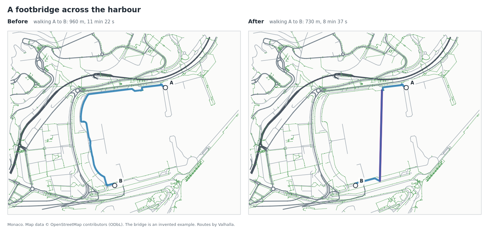
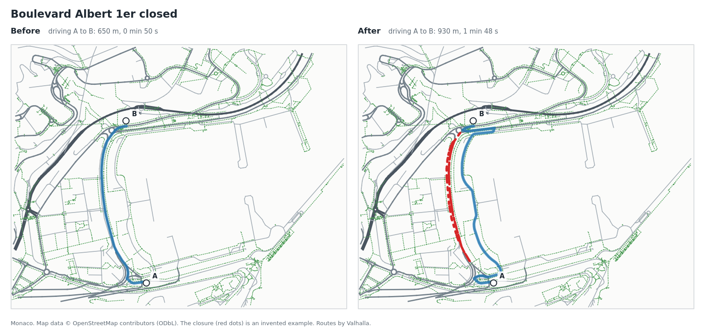
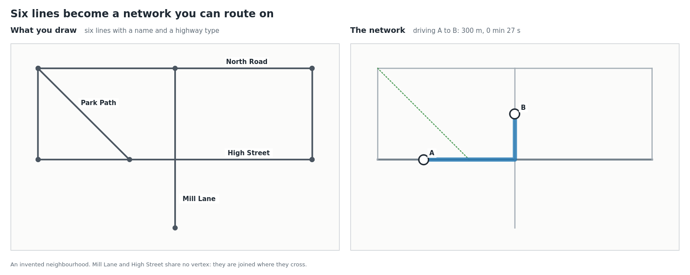
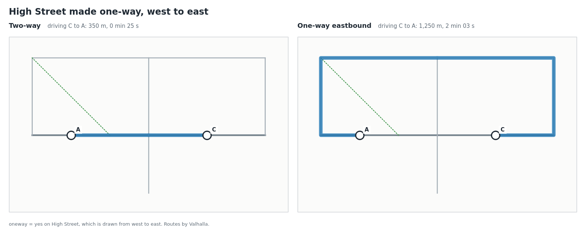
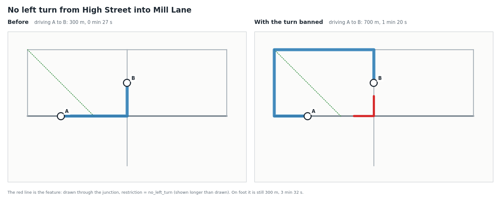
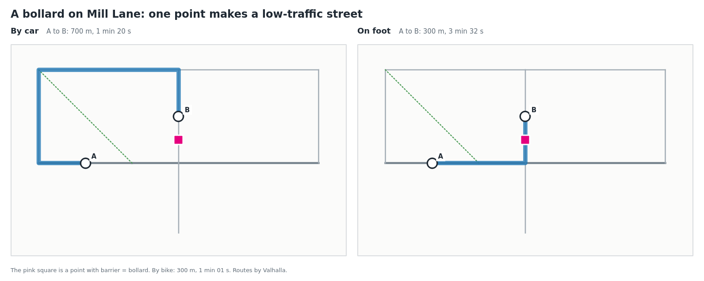

# Examples

Six worked examples, each with the layer you make, the tool you run and
a picture of the result. For the questions behind them (planning,
floods, traffic schemes) see the [use cases](use-cases.md).

Every picture is a real run. The networks were built with this plugin,
and the blue routes come from Valhalla, the router that the
[QGIS Network Analyst plugin](https://github.com/routing-earth/network-analyst-qgis-plugin)
runs, on the PBF file the plugin wrote. The script that makes them is
[`scripts/make_examples.py`](../scripts/make_examples.py).

| | Example | Tool |
|---|---|---|
| 1 | [A footbridge across a harbour](#1-a-footbridge-across-a-harbour) | Build scenario network |
| 2 | [A street closed](#2-a-street-closed) | Build scenario network |
| 3 | [A network from six lines](#3-a-network-from-six-lines) | Build standalone network |
| 4 | [A street made one-way](#4-a-street-made-one-way) | either |
| 5 | [A banned turn](#5-a-banned-turn) | either |
| 6 | [A bollard](#6-a-bollard) | either |

Examples 1 and 2 use OpenStreetMap for Monaco. Examples 3 to 6 use an
invented neighbourhood with no OpenStreetMap at all; the same attributes
work in **Build scenario network**, on your own new lines.

## 1. A footbridge across a harbour

**The layer**: one line from quay to quay, with its ends on the paths it
should join.

| highway | bridge | layer |
|---|---|---|
| `footway` | `yes` | `1` |

`bridge` and `layer` make it pass over the quay roads it crosses instead
of joining them; only its two ends join the network.

**The tool**: Build scenario network, with "Use each feature's own
attributes".

The walk from A to B drops from 960 m to 730 m, and from 11 min 22 s to
8 min 37 s. The bridge is the pink line under the route.

## 2. A street closed

A flood, roadworks or an event closes a whole street. Nothing is drawn:
the street's stretches are copied from the **Before network** layer.

**The layer**: in the Before network, select the street (here with the
expression `"name" = 'Boulevard Albert 1er'`, 79 stretches), save the
selection as a new layer, and add one field:

| osmid | remove |
|---|---|
| *(kept from the Before layer)* | `yes` |

**The tool**: Build scenario network.

The drive from A to B goes from 650 m and 50 s to 930 m and 1 min 48 s.
The closed street is gone from the After network (red dots show where
it was).

To keep the street on the map but closed, use `access` = `no` instead of
`remove`; for cars only, `motor_vehicle` = `no`.

## 3. A network from six lines

Your own street layout, with no OpenStreetMap: a planned neighbourhood,
a campus, a council's centrelines.

**The layer**: six lines.

| name | highway |
|---|---|
| High Street | `tertiary` |
| North Road | `residential` |
| West Lane | `residential` |
| Mill Lane | `residential` |
| East Lane | `residential` |
| Park Path | `footway` |

**The tool**: Build standalone network, "Lines join: wherever lines
cross or touch".

Mill Lane crosses High Street without a vertex there, and Park Path
simply ends on High Street. Both are joined, so the drive from A to B
(300 m, 27 s) can turn at the crossing. Park Path is a footway: walkers
use it, cars don't.

## 4. A street made one-way

**The layer**: as example 3, with one more field on High Street.

| name | highway | oneway |
|---|---|---|
| High Street | `tertiary` | `yes` |

Traffic runs the way the line is drawn: High Street is drawn from west
to east, so it becomes eastbound only. Use `-1` for the other way.

Driving west from C to A was 350 m. Against the one-way street it is
1,250 m, round by North Road.

On an existing OpenStreetMap street, copy it from the Before network
layer, set `oneway`, and check which way your copy is drawn.

## 5. A banned turn

**The layer**: as example 3, plus one short line drawn from High Street,
**through the junction**, into Mill Lane.

| restriction |
|---|
| `no_left_turn` |

The line needs no `highway`. It starts and ends a little way along each
street and passes through one junction.

The drive from A to B goes from 300 m to 700 m. Walkers are not bound by
turn restrictions: on foot it is still 300 m.

## 6. A bollard

**The layer**: a **point** layer with one point on Mill Lane, chosen as
the "Points layer" in the tool.

| barrier |
|---|
| `bollard` |

By car, A to B is 700 m, round the block. On foot and by bike it stays
300 m. One point has made Mill Lane a street with no through traffic.

Other points work the same way: `highway` = `traffic_signals`, or
`highway` = `crossing` with `crossing` = `zebra`.

## Good to know

- Turn restrictions and bollards are obeyed by routers. QGIS's own
  network tools (Service area, Shortest path) ignore them, so compare
  those examples in the Network Analyst plugin.
- The trips start and end part-way along a street, not on a corner.
- Map data in examples 1 and 2 © OpenStreetMap contributors (ODbL). The
  bridge and the closure are invented.
